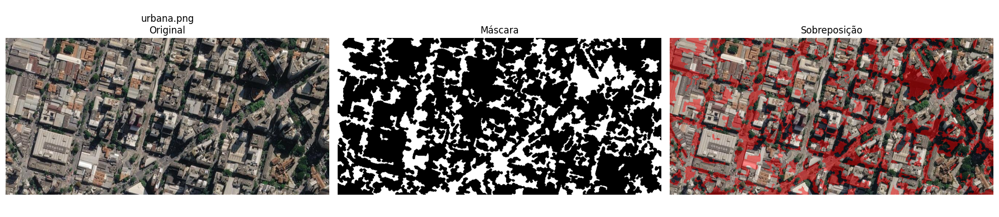
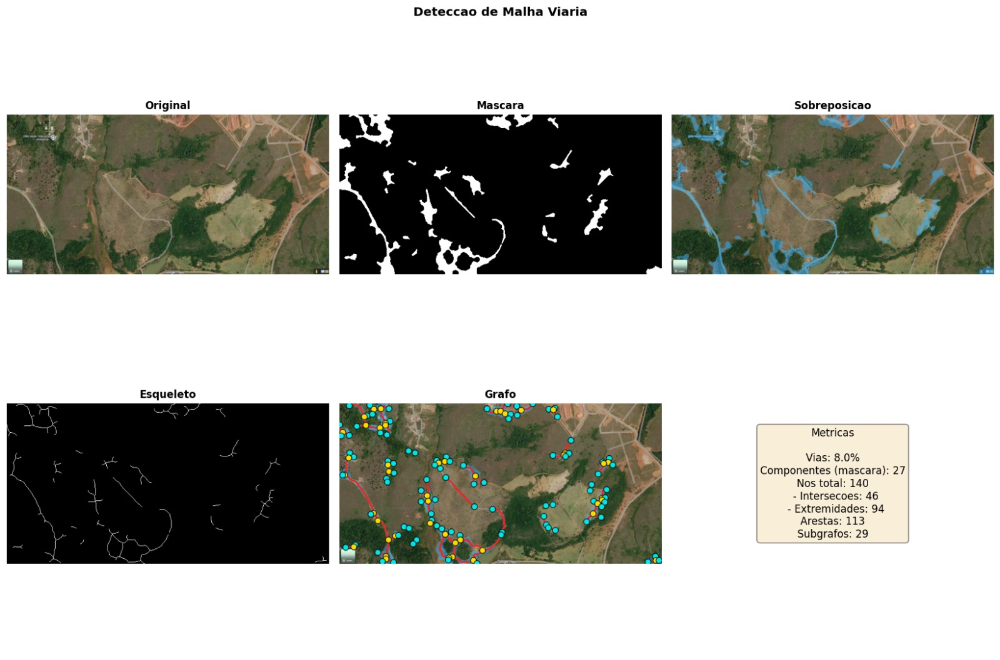

# Road Network Detection in Satellite Images

Team project for the **Pattern Recognition** course at UFMG, by
**Beatriz Vocurca Frade**, **Johnatan Augusto Moreira do Carmo** and **Marina Alves Resende**.

The goal is to detect roads in satellite images using classical computer vision, with no neural-network training, and to rebuild the road network as a graph.



## How it works

The pipeline in [`notebook/deteccao_malha_viaria.ipynb`](notebook/deteccao_malha_viaria.ipynb) combines several visual cues:

1. **Pre-processing:** resize, bilateral filtering, and HSV/Lab conversion with CLAHE contrast enhancement.
2. **Cues:** a "grayness" score for asphalt, an NDVI-like index `(G−R)/(G+R)` to mask out vegetation, local texture homogeneity, and a **Frangi ridge filter** (σ 1–5) to capture linear structures.
3. **Scoring:** weighted *urban* and *rural* road scores, each thresholded at a per-image quantile.
4. **Shape refinement:** morphological opening with **oriented line structuring elements** at several angles and lengths, then cleanup of small objects and holes.
5. **Output:** a binary road mask plus an overlay on the original image.

An earlier version also rebuilt the **road graph** ([`src/malha_viaria.py` at c636dc0](https://github.com/BeatrizVocurcaFrade/trabalho_rp/blob/c636dc0/src/malha_viaria.py)). It skeletonized the mask, found intersections and endpoints from 8-neighbour pixel degree, traced edges into a **NetworkX** graph, and exported it to JSON and GraphML.



The report ([`relatorio/main.tex`](relatorio/main.tex)) covers how the approach evolved: color clustering (V1), multiscale linear structure (V2), then a hybrid urban/rural model (V3). It also discusses the limits: without labelled data there is no IoU or F1 benchmark.

**Stack:** Python · NumPy · OpenCV · scikit-image · NetworkX · Matplotlib · Jupyter · LaTeX/Beamer · GitHub Actions (syncs the notebook to Google Drive whenever it changes).

---

## Versão em português

Projeto prático da disciplina de **Reconhecimento de Padrões** (UFMG) para detectar vias em imagens de satélite, gerar uma segmentação visual e explorar a reconstrução da malha viária como grafo.

### Estrutura

- `notebook/deteccao_malha_viaria.ipynb`: pipeline principal de segmentação, com visualizações.
- `data/raw/`: imagens de entrada (`.png`, `.jpg`, `.jpeg`, `.tif`, `.tiff`, `.bmp`).
- `data/results/`: máscaras, sobreposições e visualizações.
- `relatorio/main.tex`: relatório técnico em LaTeX.
- `apresentacao/main.tex`: apresentação Beamer em LaTeX (figuras em `apresentacao/fig/`).
- A etapa de grafo (esqueletização + NetworkX, exportação JSON/GraphML) está em [`src/malha_viaria.py` no commit c636dc0](https://github.com/BeatrizVocurcaFrade/trabalho_rp/blob/c636dc0/src/malha_viaria.py).

### Como executar

1. Crie e ative um ambiente virtual:

```bash
python3 -m venv .venv
source .venv/bin/activate
```

Em Debian/Ubuntu, se `venv` ou `pip` não estiverem instalados, instale antes os pacotes `python3-venv` e `python3-pip`.

2. Instale as dependências:

```bash
pip install -r requirements.txt
```

3. Coloque uma ou mais imagens de satélite em `data/raw/`.

4. Abra o notebook e execute todas as células. Os resultados são salvos em `data/results/`.

```bash
jupyter notebook notebook/deteccao_malha_viaria.ipynb
```

### Como gerar os PDFs

```bash
make report   # só o relatório
make slides   # só os slides
make pdf      # os dois
```

Os arquivos finais são `relatorio/main.pdf` e `apresentacao/main.pdf`.

### Observação metodológica

A solução usa visão computacional clássica, sem treinamento de rede neural. Isso deixa o comportamento mais explicável para o relatório e permite processar imagens novas sem depender de uma base anotada.
